**REALESTATE mobile app**
 
👉WELCOME SCREEN 
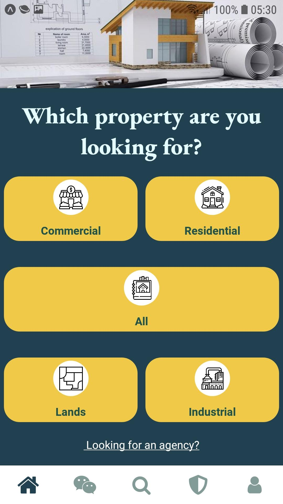

👉PUSH NOTIFICATIONS 
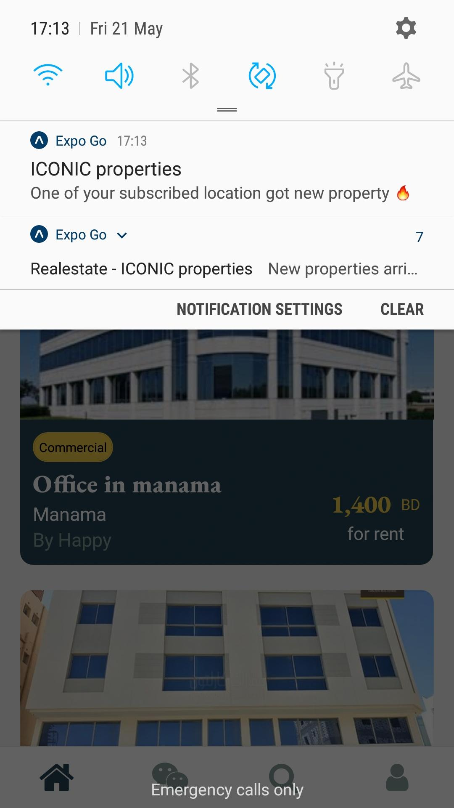

👉SUBSCRIBE LOCATIONS to get notified for properties posted on those locations 
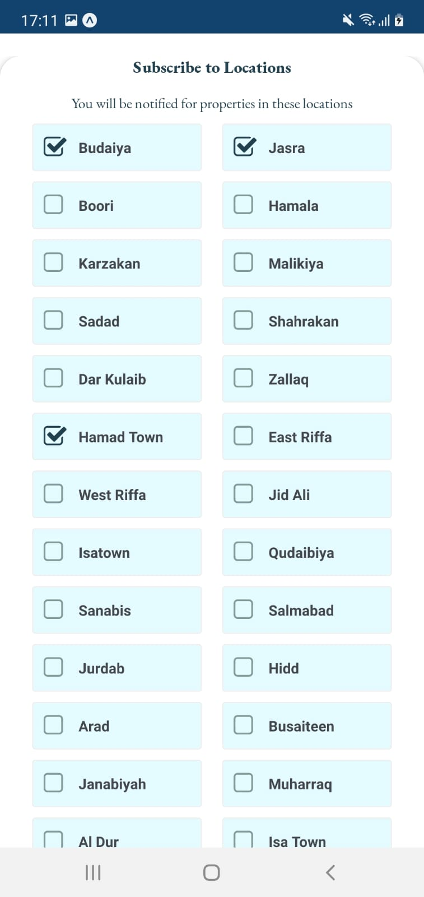

👉PROPERTIES 
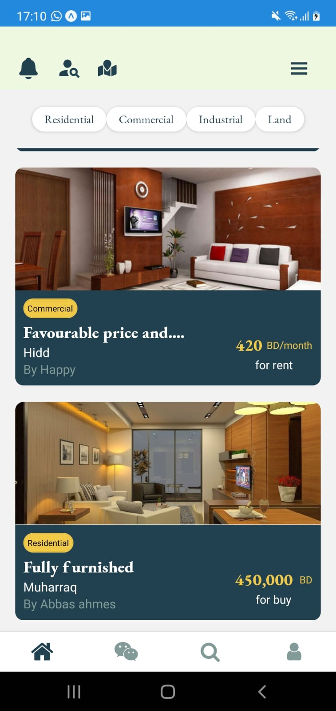

👉PROPERTY DETAILS 
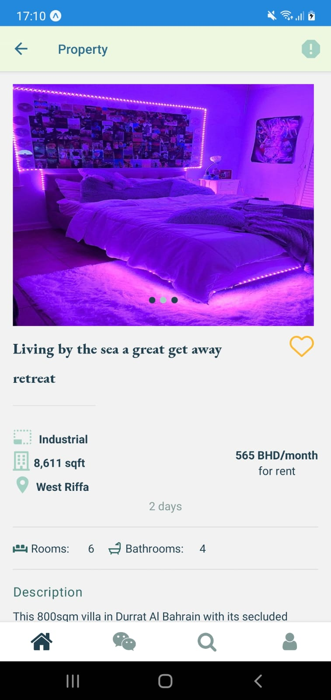
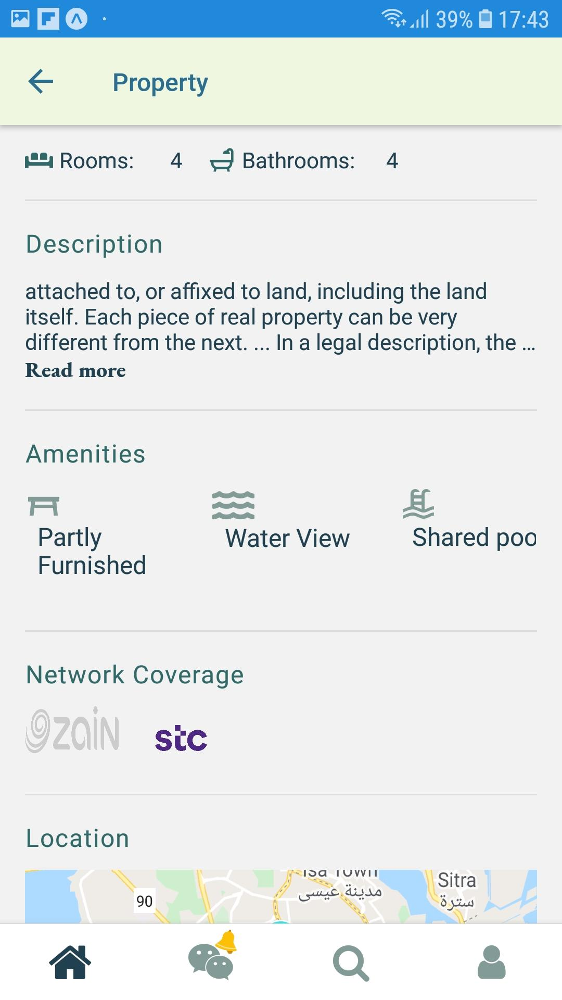

👉 ADMIN STATISTICS 
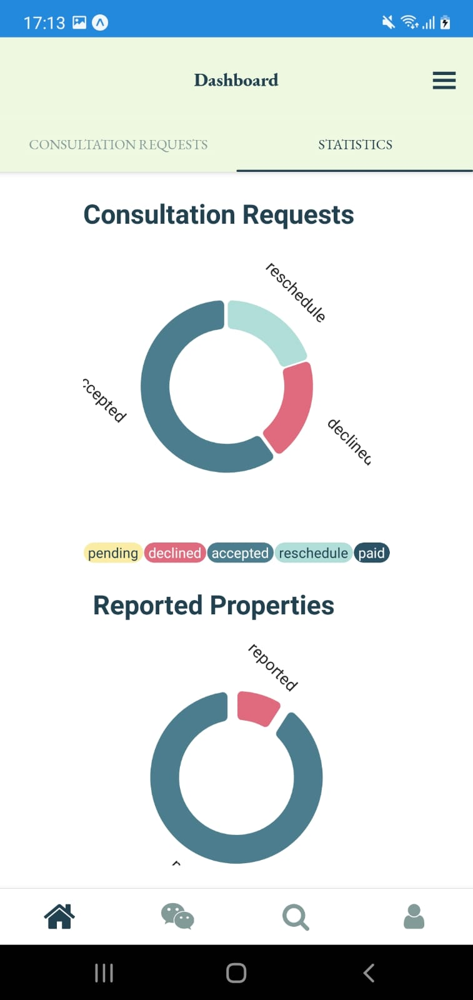

👉AFFORDIBILITY CALCULATOR for clients 
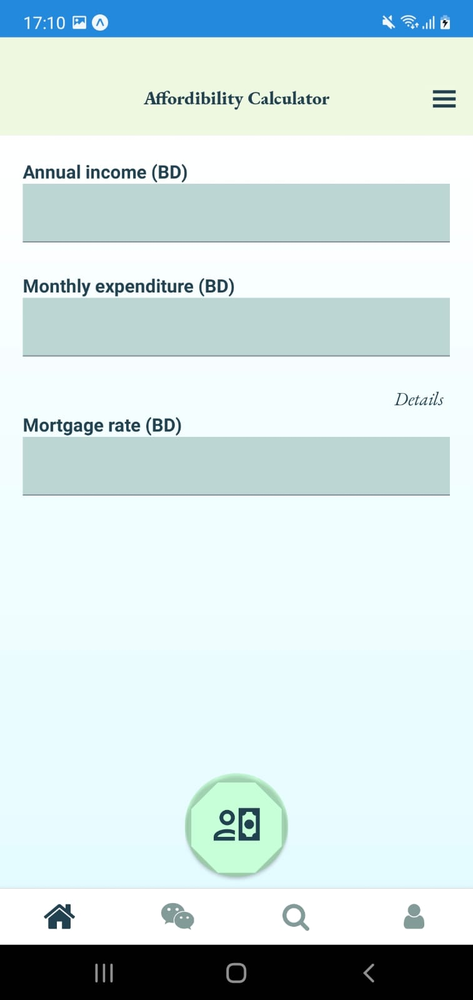

👉CHAT between client and sellers 
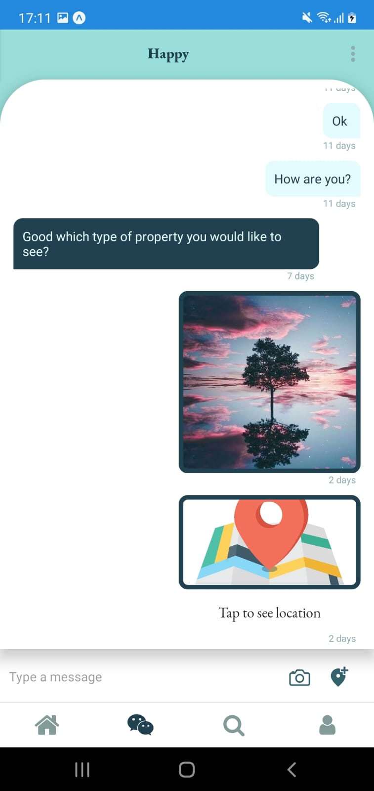

👉PROPERTY SEARCH BY MAPS 

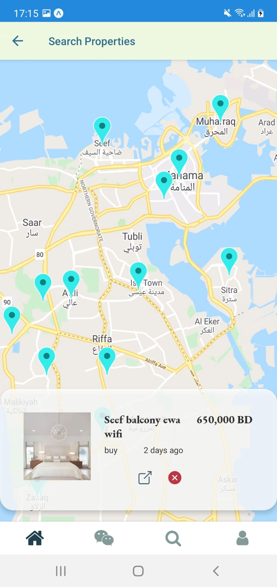

👉PROPERTY CUSTOMIZED SEARCH 
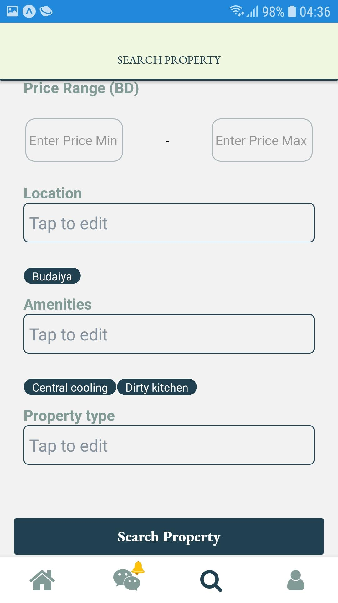

👉Seller Search 
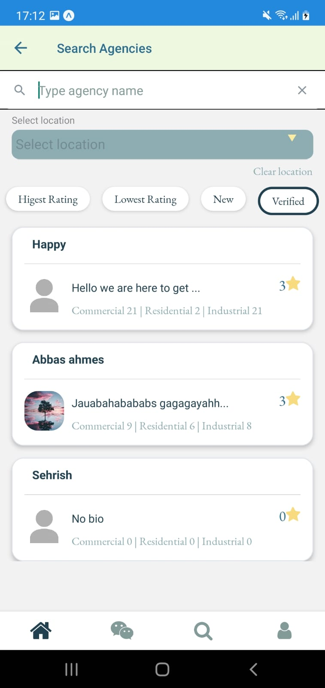

👉RATE AND REVIEW SELLER 
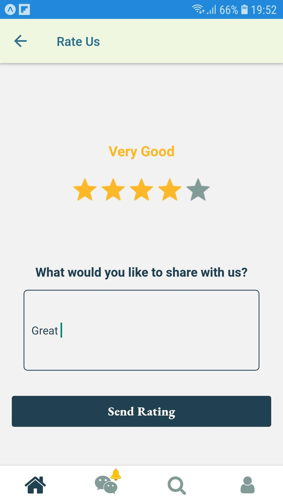

**Description**
“ICONIC” properties is a cross-platform mobile application developed to take the real estate businesses in Bahrain to the next level, targeting real estate sellers and people interested in buying and renting property, providing real estate seekers the ability to search for properties and view their details, find sellers, contact them and much more. Sellers as well have the ability to manage their business and clients’ requests and messages and much more all in one app. “ICONIC” properties application aims to solve people’s real estates related issues and make their lives easier, by providing them a useful, effective and easy to use mobile application that links real estate seekers and sellers with each other efficiently.
